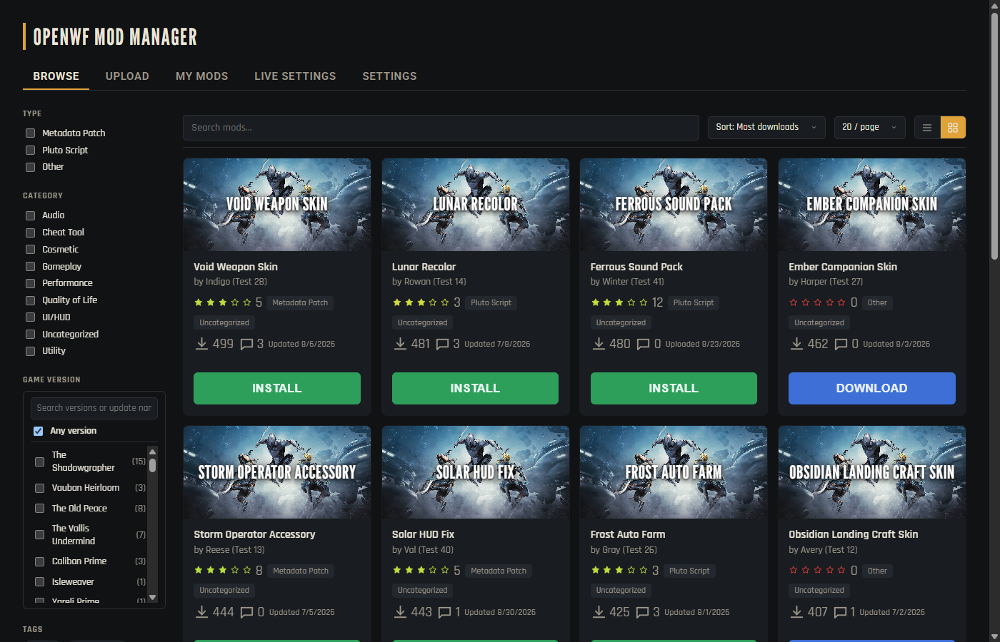
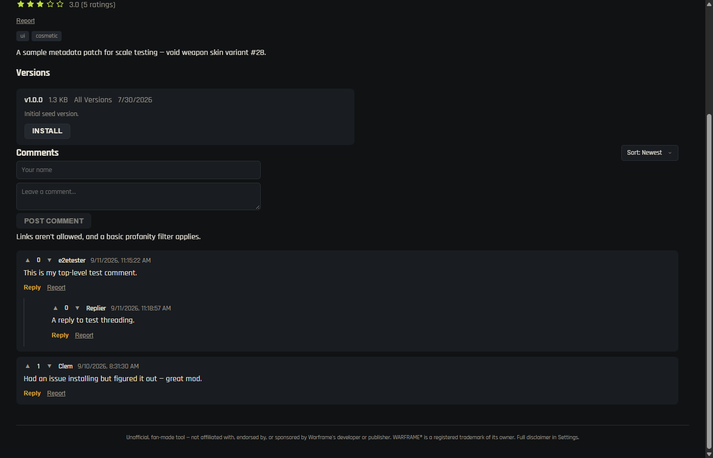
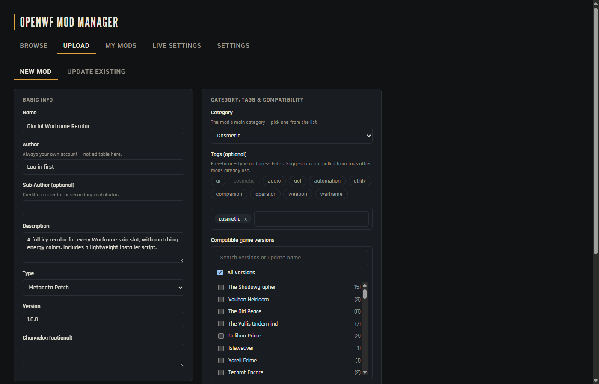

<div align="center">


# OpenWF Mod Manager

**A desktop mod manager for [OpenWF](https://about.openwf.io/) / SpaceNinjaServer.**
Browse, install, update, and uninstall mods — metadata patches, `.pluto`
scripts, and more — instead of manually shuffling files from Discord links
into the right folder.

[](https://tauri.app/)
[](https://react.dev/)
[](https://www.typescriptlang.org/)
[](https://workers.cloudflare.com/)


</div>

<p align="center">
  
</p>

## What it does

Point it at your Warframe/OpenWF install folders once, and it takes over
from there: browse a community catalog, install with one click, get
version-history and changelogs, and keep everything up to date — no more
digging through Discord for the right `.zip`.

| | |
|---|---|
| 🗂️ **Browse & install** | Sidebar filters (type, category, game version, tags), grid/list views, one-click install/uninstall/reinstall with real installed-state tracking on disk |
| ⭐ **Ratings & comments** | 0–5 star ratings, Reddit-style threaded comments with up/down voting, link + profanity filtering |
| 👤 **Profiles** | Click any author's name to see everything they've published, fixed-palette avatars |
| ⬆️ **Upload & manage** | Drag-free upload flow with tag suggestions pulled from what's already in use, per-mod version history, edit metadata after the fact |
| 🛡️ **Moderation** | Reports queue, admin bans/deletes, site-wide kill-switches (maintenance mode, disable uploads/comments), all audit-logged |
| 🔑 **Accounts** | Self-service username/password signup, or an old-style API key — both work everywhere the same way |

<table>
<tr>
<td width="50%">

<p align="center"><sub>Reddit-style comment threading & voting</sub></p>
</td>
<td width="50%">

<p align="center"><sub>Upload with tag suggestions & version compatibility</sub></p>
</td>
</tr>
</table>

See [docs/architecture.md](docs/architecture.md) for the full design —
stack choices, data flow, schema, API surface, and security notes.

## Tech stack

- **Desktop app** — [Tauri 2](https://tauri.app/) (Rust) + React 18 + TypeScript + Vite, response validation via [Zod](https://zod.dev/)
- **API** — [Hono](https://hono.dev/) on Cloudflare Workers, [D1](https://developers.cloudflare.com/d1/) for metadata, mod files hosted as GitHub Release assets
- **Auth** — self-service accounts (PBKDF2-hashed passwords) or legacy API keys, sessions stored in D1
- Zero payment surface anywhere in the stack — see [docs/architecture.md § Security & billing-risk notes](docs/architecture.md)

## Quick start

Requires [Node.js](https://nodejs.org/) and [Rust](https://www.rust-lang.org/tools/install) (for the Tauri shell).

```bash
git clone https://github.com/EmberCatz/OpenWF-Mod-Manager.git
cd OpenWF-Mod-Manager
npm install
npm run dev:desktop
```

That points at the deployed API by default. To run the API locally too
(`apps/api`), see [docs/architecture.md § Local dev](docs/architecture.md#local-dev).

There's no published installer yet — see [`TODO.md`](TODO.md) for the
plan to ship one via a Tauri auto-updater.

## Layout

| Path | What's in it |
|---|---|
| [`apps/desktop/`](apps/desktop/) | The Tauri + React + TypeScript client. |
| [`apps/api/`](apps/api/) | The Cloudflare Worker API (Hono), backed by D1 + GitHub Releases. |
| [`packages/shared/`](packages/shared/) | TypeScript types shared between the two, mirroring the D1 schema. |
| [`docs/architecture.md`](docs/architecture.md) | Design doc: stack, data flow, schema, API routes, security follow-ups. |
| [`TODO.md`](TODO.md) | Tracked list of planned/considered work. |

For the mod *content* itself (the actual OpenWF metadata-patch DSL and
`.pluto` scripting conventions this manager ships), see the docs in the
parent [`OPENWF _ Modding/docs/`](../docs/) folder.

## Status

Live and working: the API is deployed, mods can be uploaded/browsed/
installed/uninstalled/updated end to end. See [`TODO.md`](TODO.md) for
what's next, including a running list of tracked security follow-ups.

## Contributing

Issues and PRs are welcome. There's no formal contribution guide yet —
[docs/architecture.md](docs/architecture.md) is the best starting point for
understanding how things fit together before diving in.

## Disclaimer

This is an independent, community-made project and is **not affiliated
with, endorsed by, sponsored by, or otherwise connected to the developer
or publisher of Warframe.** WARFRAME® and the WARFRAME logo are
registered trademarks of their respective owner; they, and any other game
content/assets referenced here, remain the property of their respective
owners. Their use here is solely to describe compatibility and does not
imply sponsorship or endorsement.

This tool is built for use with [OpenWF](https://about.openwf.io/), an
independent, community-run project — it does not connect to or interact
with Warframe's official servers in any way.

Mods distributed through this project (metadata patches, `.pluto`
scripts) are user-submitted content, provided "as is" without warranty of
any kind; they are not reviewed, endorsed, or guaranteed by this project.
Using modified clients or unofficial servers with Warframe may conflict
with its End User License Agreement — you're solely responsible for
understanding and complying with whatever terms apply to your own use.

If you're a rights holder with a concern about content hosted or
distributed through this project, open an issue on this repo or reach out
directly — it will be addressed promptly.
